<div align="center">

# ✨ Simple & Elegant Website ✨


<p align="center">
  
  
  
</p>

---

###**Project Vision**

> *"Simplicity is the ultimate sophistication."* — Leonardo da Vinci

Kami sedang membangun sebuah website yang menggabungkan **kesederhanaan** dengan **keanggunan**. Setiap elemen dirancang dengan cermat untuk memberikan pengalaman pengguna yang luar biasa.

---

</div>

##Fitur Utama

```ascii
╔══════════════════════════════════════════════════════════╗
║                                                          ║
║   🎨  Design Minimalis & Modern                         ║
║   ⚡  Performance Tinggi & Loading Cepat                ║
║   📱  Responsive di Semua Device                        ║
║   ♿  Accessibility First                                ║
║   🔒  SEO Optimized                                      ║
║   🌈  Smooth Animations & Transitions                   ║
║                                                          ║
╚══════════════════════════════════════════════════════════╝
```

<div align="center">

##Tech Stack

<table>
<tr>
<td align="center" width="150">

<br><strong>HTML5</strong>
</td>
<td align="center" width="150">

<br><strong>CSS3</strong>
</td>
<td align="center" width="150">

<br><strong>JavaScript</strong>
</td>
</tr>
</table>

</div>

---

##Roadmap

```mermaid
graph LR
    A[🎨 Design] -->|✓| B[💻 Development]
    B -->|Current| C[🧪 Testing]
    C --> D[🚀 Launch]
    D --> E[📈 Optimization]
    
    style A fill:#10B981,stroke:#059669,color:#fff
    style B fill:#10B981,stroke:#059669,color:#fff
    style C fill:#6366F1,stroke:#4F46E5,color:#fff
    style D fill:#6B7280,stroke:#4B5563,color:#fff
    style E fill:#6B7280,stroke:#4B5563,color:#fff
```



<div align="center">

###Development Progress

<table>
<tr>
<td align="center">🎨 UI Design</td>
<td align="center">💻 Frontend</td>
<td align="center">🔧 Backend</td>
<td align="center">✨ Polish</td>
</tr>
<tr>
<td align="center">

</td>
<td align="center">

</td>
<td align="center">

</td>
<td align="center">

</td>
</tr>
</table>

</div>

---

##Design Philosophy

<table>
<tr>
<td width="50%">

###Minimalism
Kami percaya bahwa *less is more*. Setiap elemen memiliki tujuan dan makna.

###Fluid Experience
Transisi yang halus dan interaksi yang natural membuat pengguna betah.

</td>
<td width="50%">

###Visual Hierarchy
Typography dan spacing yang tepat membimbing mata pengguna.

### ⚡ Performance
Website yang indah harus tetap cepat dan efisien.

</td>
</tr>
</table>

---

<div align="center">

##Preview

> *Sneak peek ke dalam apa yang sedang kami bangun...*

```
┌────────────────────────────────────────────────┐
│                                                │
│   🎨 Beautiful Hero Section                   │
│   📱 Responsive Navigation                     │
│   ✨ Smooth Scroll Animations                 │
│   🖼️  Gallery dengan Lightbox                 │
│   📝 Contact Form yang Elegan                 │
│   🌙 Dark Mode Support                        │
│                                                │
└────────────────────────────────────────────────┘
```

---

##Contributing

Proyek ini masih dalam tahap pengembangan aktif. Stay tuned untuk update!

```bash
# Coming soon...
git clone [repository-url]
npm install
npm run dev
```

---

##Contact

<p align="center">
  <a href="mailto:your.email@example.com">
    
  </a>
  <a href="https://twitter.com/yourusername">
    
  </a>
  <a href="https://linkedin.com/in/yourusername">
    
  </a>
</p>

---


<sub>Star this repo jika kamu menyukai proyek ini!</sub>

</div>
